# My Holiday - Holiday Booking Application

My Holiday is a full-stack web application that allows users to book holidays while administrators manage bookings and user access. It is built with Flask, PostgreSQL, and is deployed on Heroku.

## Table of Contents

- [Overview](#overview)
- [Features](#features)
- [Images](#images)
- [Installation](#installation)
- [Usage](#usage)
- [Admin Access](#admin-access)
- [Technologies Used](#technologies-used)
- [Deployment](#deployment)
- [Credits](#credits)
- [Testing](#testing)
- [Automative-testing](#automative-testing)
- [License](#license)

## Overview

This app allows users to:
- Register and log in securely
- Submit and view holiday booking requests
- Receive booking status updates

Admin users can:
- View all bookings
- Change booking statuses
- Manage users

## Features

- User registration and login system
- Admin dashboard with role-based access control
- Database integration with PostgreSQL
- Mobile responsive design using Bootstrap
- Deployment-ready with Heroku support

## Images

  

    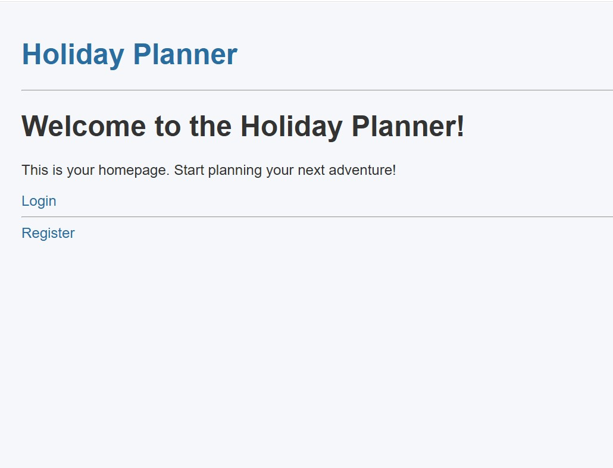
  

  

    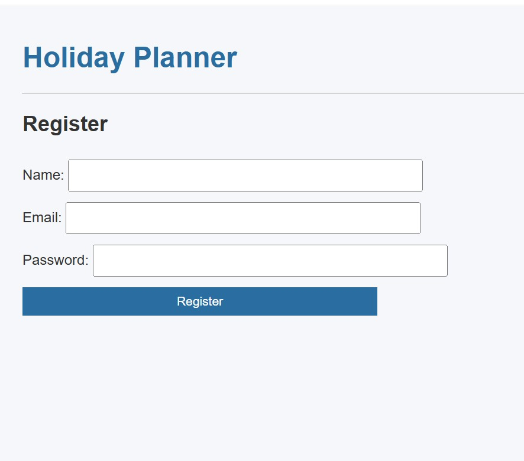
  

  

  

  

    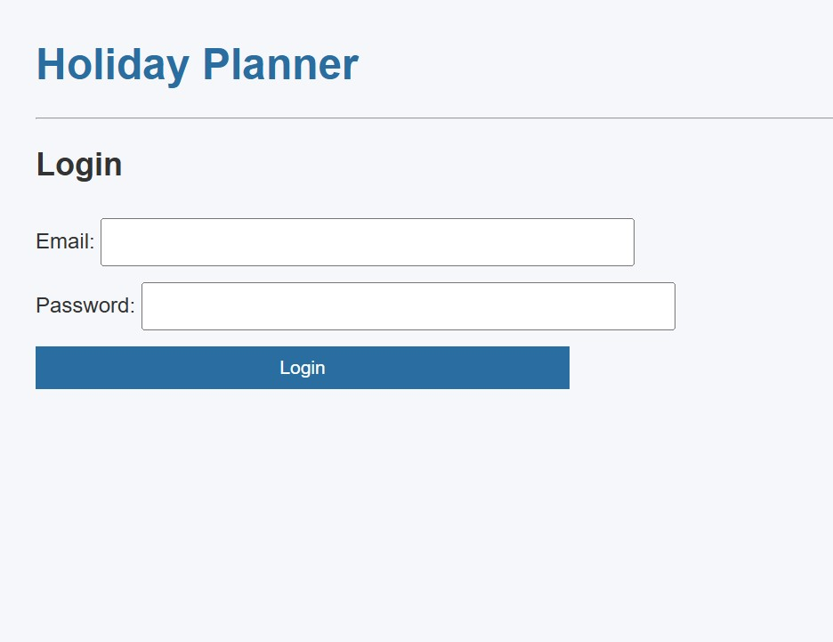
  

  

    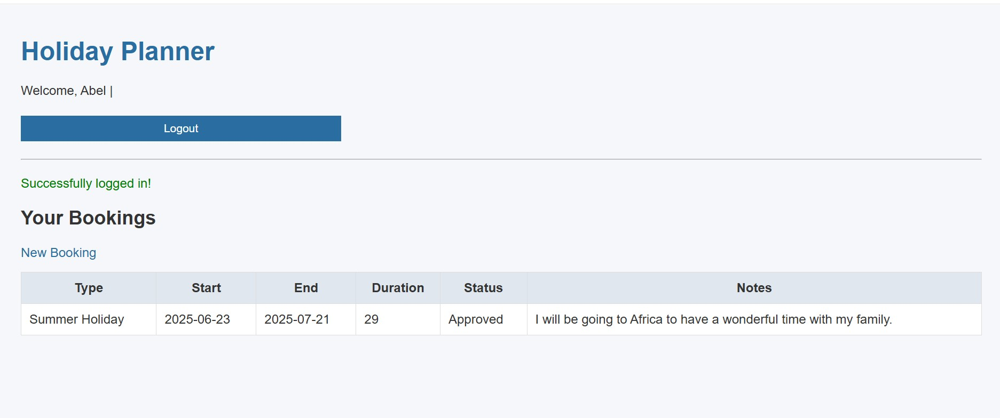
  

  

  

  

    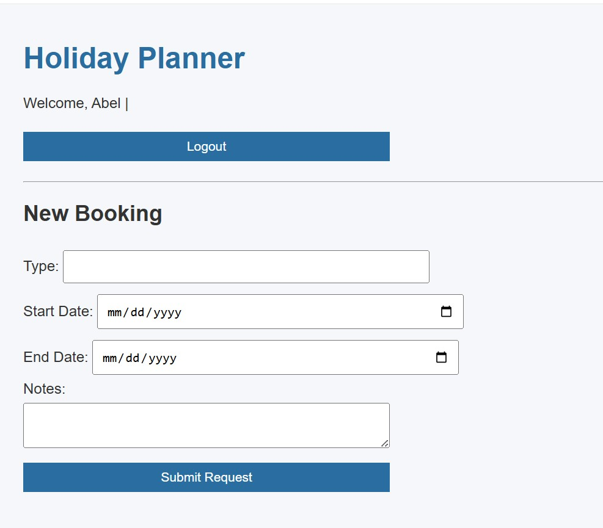
  

  

    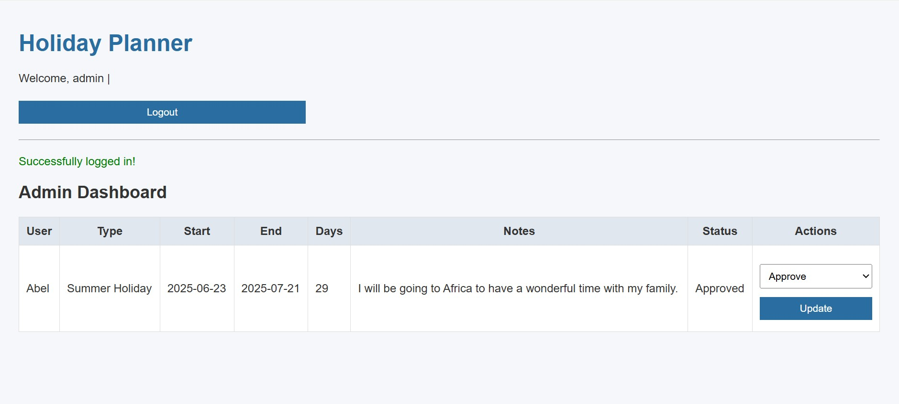
  

  

## Installation

1. Clone the repository:
``bash
- git clone https://github.com/abi19x/my_holiday
- cd my_holiday

2. **Set up a virtual environment**:
- python3 -m venv venv
- source venv/bin/activate

3. **Install dependencies**:
- pip install -r requirements.txt

4. **Set environment variables**:
- export FLASK_APP=run.py
- export FLASK_ENV=development
- export DATABASE_URL=your-database-url

5. **Initialize the database**:

- from models.db import init_db
- from app import app
- init_db(app)

6. **Run the app locally**:
- python3 run.py runserver

## Usage

- Users can register, login, and book holidays
- Admins can log in and access the **/admin** dashboard to **view and manage bookings**

## Admin Access

To manually create an admin user on Heroku:
1. **Retrieve the database URL:**
heroku config:get DATABASE_URL -a my-holiday
2. **Run an interactive shell on Heroku:**
heroku run python -a my-holiday
3. **Create the admin user:**
import psycopg
from werkzeug.security import generate_password_hash

db_url = "PASTE_YOUR_HEROKU_DATABASE_URL_HERE"
conn = psycopg.connect(db_url)
cur = conn.cursor()

hashed_pw = generate_password_hash("your-password")

cur.execute("""
    INSERT INTO users (name, email, password, role)
    VALUES (%s, %s, %s, %s);
""", ("admin", "admin@example.com", hashed_pw, "admin"))

conn.commit()
cur.close()
conn.close()

## Technologies Used

- **Flask** - Lightweight Python web framework
- **PostgreSQL** - Relational database management
- **psycopg** - PostgreSQL database adapter
- **Werkzeug** - Secure password hashing
- **Bootstrap** - Frontend UI framework
- **Heroku** - Cloud application platform

## Deployment (Heroku)

**To deploy the app on Heroku:**
- heroku create my-holiday
- heroku addons:create heroku-postgresql:hobby-dev
- git push heroku main
- heroku run python

## Credits

- **Code Institute** - Project structure and inspiration
- **Flask and Psycopg Documentation**
- **Bootstrap** - For frontend styling and responsive design
- **Werkzeug** - For generating and checking password hash 
- **Heroku** For documentation and providing a cloud application platform for project deployment

## Testing

- The homepage was validated through the official W3C validator website and there were no bugs detected. See the image below. 
 

    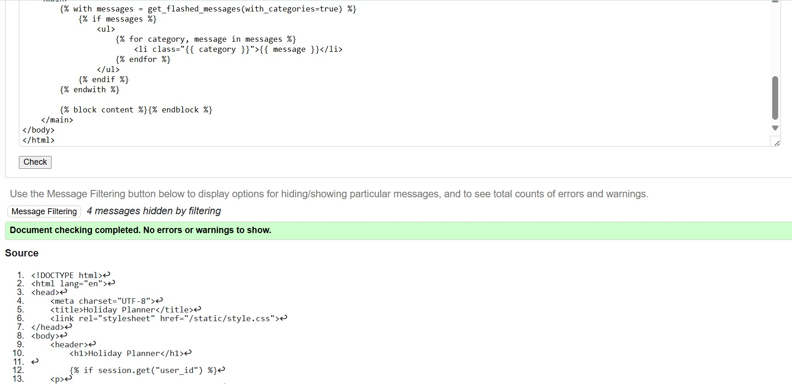
  

- The register and login pages were validated through the official W3C validator website and there were no errors detected. See the respected images below. 

    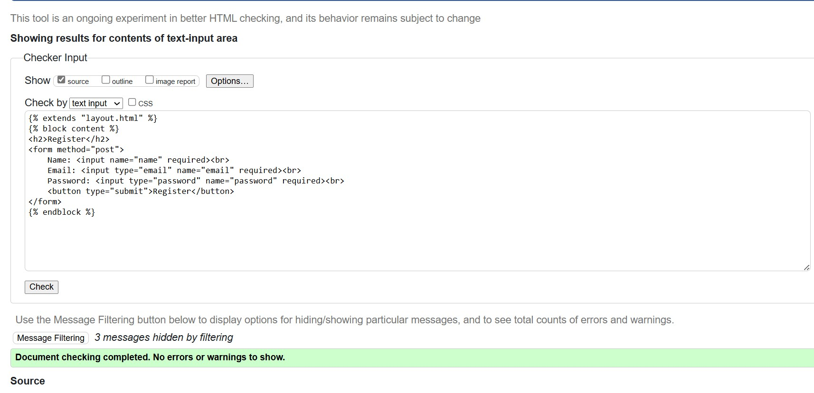
  

  

    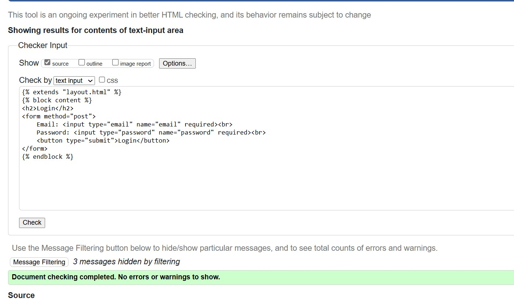
  

- The dashboard and admin pages were validated through the official W3C validator website and there were no bugs found in both pages. See the respected images below. 
 

    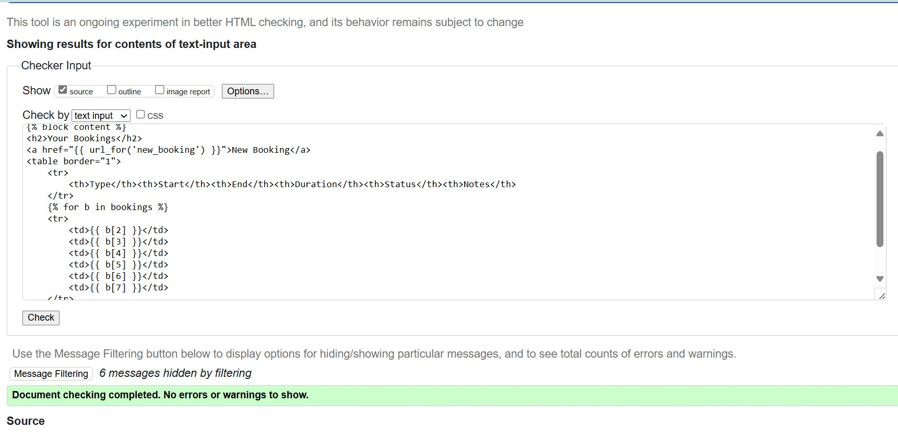
  

  

    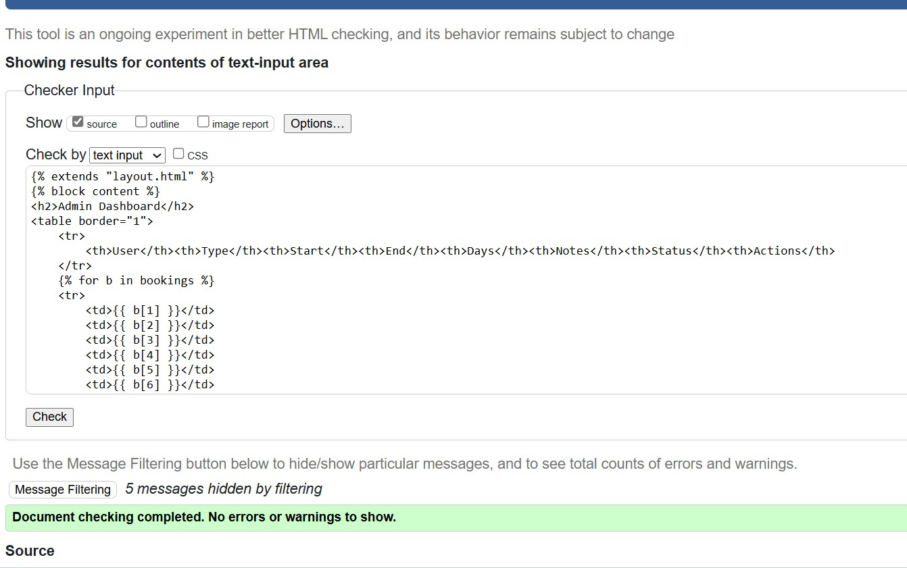
  

- The new booking page was validated through the official W3C validator website and there were no bugs detected. See the image below. 
  

    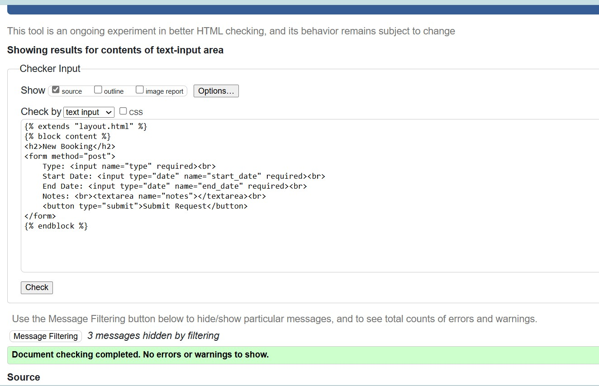
  

- I have confirmed multiple times that the main page is linked rightfully to the custom CSS file. I can now confirm that the custom CSS file in this project passes through the official W3 Jigsaw CSS validor with no issues. See the screenshot below. 

    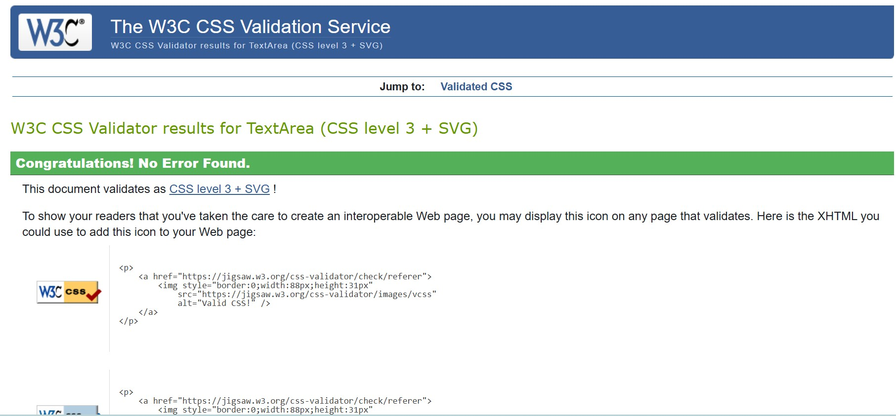
  

## Automative-testing

Automative testing framework that is designed to make sure correctness of any codebase written by developers. This particular framework will allow you to write tests with an approachable, well known and highly interactive API that gives you results quickly. 

Manual website testing is conducted by human testers manually checking the website through interaction with the site developed. Testers usually follow test cases but they can also explore freely. Manual testing is best for usability testing, exploratory testing and UI validation. On the other hand automative website testing uses scripts and software tools like Selenium or Cypress. This type of testing can run tests on multiple browsers and devices automatically. Automative website testing is best for regression testing, load testing and repetitive tasks. 

Since 99% of the language used in this project was Python, it is only rational to include a Python testing methods to detect if any errors are presents in the functions and semantics of the files in my project.

- All forms in the register and login pages have passed the automative tests with no erros detected. 

    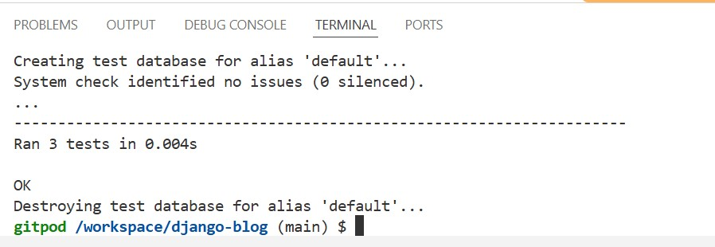
  

- The new booking page for users to submit their holiday period after they have loged in was validated with aumative tests.

    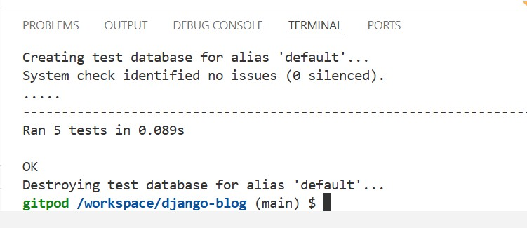
  

- The admin page to view and approve the holiday period requested by users was validated in automative testing method with no bugs found. 

    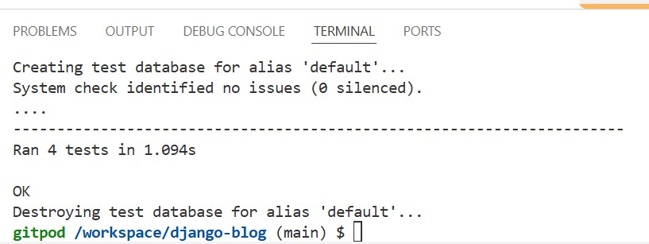
  

  
